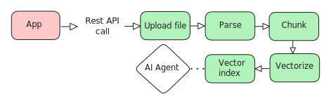
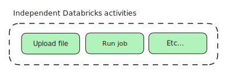
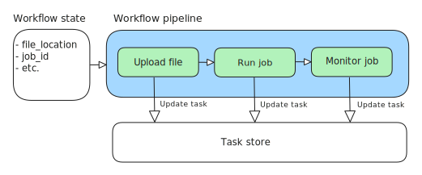
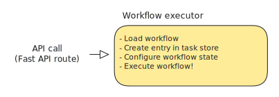
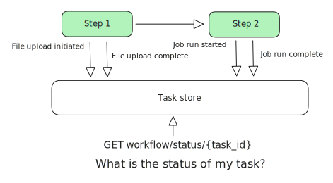

## The Databricks Async REST API Framework for Apps

A framework for building REST APIs to orchestrate Databricks activities. This framework provides a composable, [pipeline-based architecture](https://en.wikipedia.org/wiki/Pipeline_(software)) for managing async workflows with built-in task tracking, job execution, and monitoring.  It lets you trigger multiple Databricks activities with a single API call, ready to plug into your other Databricks apps.  
 
For example: 




### Concepts:
**Steps:**  


Steps are individual and independent processing units, such as uploading a file or running a Databricks job. Steps have a common interface (the execute method). They also share state, a StepContext. Steps require a StepContext as an input and return an updated StepContext. This allows Steps to share information, such as a file location or job id with proceeding Steps in your workflow. You can create new Steps to trigger any Databricks activity accessible by the [Databricks Rest API](https://docs.databricks.com/api/workspace/introduction).


**WorkflowPipeline:**  


Steps are executed in a sequence using a WorkflowPipeline, passing the updated StepContext from one Step to the next. Since Steps are independent of one another, a WorkflowPipeline can chain any arbitrary Databricks activities together into a single API call. Steps report on their progress by updating the TaskStore (implementation in Redis and Lakebase, but extendable to others). This allows every workflow to be monitored end to end, even though several Databricks APIs may be triggered. The status of any workflow can be accessed via GET /workflow/status/{task_id}.


**WorkflowExecutor:**  


The entry point for WorkflowPipeline executions, the WorkflowExecutor loads the requested workflow pipeline for an API request, creates a new task_id in the Task Store, configures the initial StepContext, and triggers the pipeline's execution. Fast API routes trigger pipelines using this executor.

**TaskStore:**  


A backend that monitors pipeline execution status. TaskStores are provided for Lakebase and Redis, simply set TASK_STORE_BACKEND to use your desired host (lakebase or redis). TaskStore provides a standard interface to easily integrate other backend databases.

####To configure the app
See the .env.example file for a list of environment variables required to deploy your app. This file is used to define environment variables for local development. Environment variables must also exist in app_example.yaml for Databricks Apps deployment. Don't forget to remove 'example' from your own file versions!

To quickly validate your TaskStore connection locally, use one of the below examples.

Lakebase:
```
from dotenv import load_dotenv

load_dotenv()

import asyncio
from dotenv import load_dotenv
from rest_api.services.task_store.postgres_store import PostgreSQLTaskStore


async def check_postgres_store():
    store = PostgreSQLTaskStore()
    pool = await store._get_pool()
    async with pool.acquire() as conn:
        value = await conn.fetchval("SELECT 1")
        print(f"Connection OK, SELECT 1 -> {value}")
    await store.close()

asyncio.run(check_postgres_store())
```  

Redis:
```
from dotenv import load_dotenv

load_dotenv()

import asyncio
from rest_api.services.task_store.redis_store import RedisTaskStore

async def check_redis_store():
    store = RedisTaskStore()
    redis = await store._get_redis()
    pong = await redis.ping()
    print(f"Redis ping -> {pong}")

    # Optional: do a basic set/get round-trip
    await redis.set("taskstore:test", "ok", ex=10)
    value = await redis.get("taskstore:test")
    print(f"Redis round-trip value -> {value}")

    await store.close()

asyncio.run(check_redis_store())
```

#### To add your own, custom Steps and Workflows, follow these steps. 

1. Review the available Steps in `workflows/steps` to determine if the Step you need is already available.
2. If the Steps are available, determine if the Workflow you need is already available in `workflows/definitions`,
3. You can easily create your own custom Steps and Workflows by adopting the standard interfaces shown in the above files. To start...
     - Confirm that `services/client.py` contains the Databricks REST API calls you need. If not, simply add them.
     - Determine if the StepContext class in `workflows/pipeline.py` has all the necessary fields you want to record your  Step's activities. If not, simply add them.
     - Create your own Step following the examples in `workflows/steps`. Your step should update the StepContext and TaskStore, following the patterns in the examples.
     - Create a new workflow definition in `workflows/definitions`.
     - Update the WorkflowExecutor's workflow parameter in `workflows/executor.py`.
     - Add a FastAPI route to call your workflow (through the WorkflowExecutor) in `v1/endpoints`.


#### NOTES:
An example workflow will soon be available!
